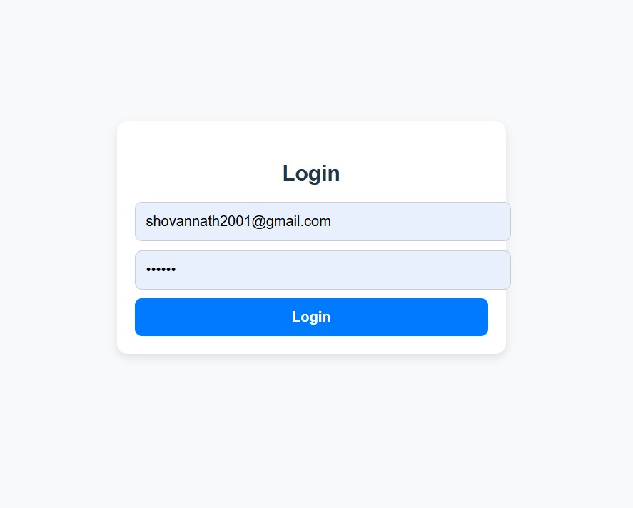
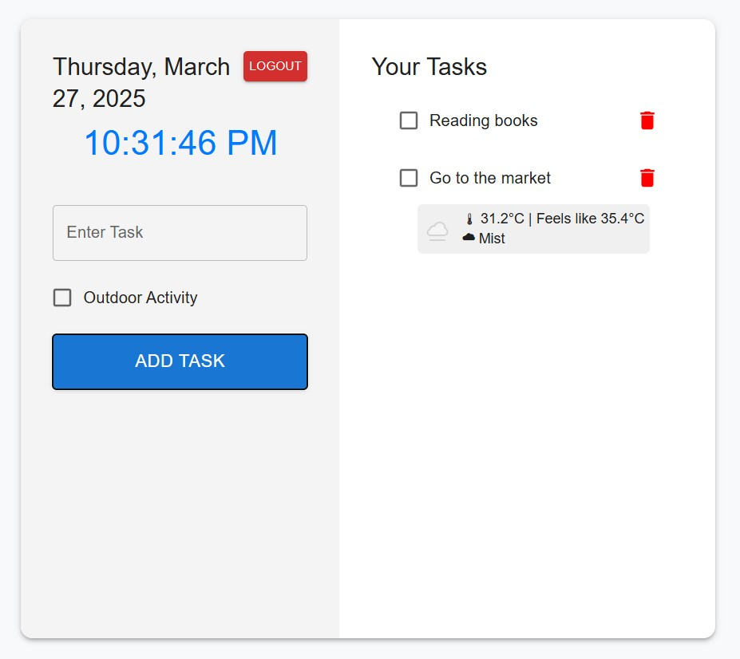

Here’s a **professional** `README.md` file for your **Advanced React To-Do App**. I've included placeholders for screenshots—replace them with your actual image paths.

---

# **Advanced React To-Do App 🚀**  

A modern **React-based** To-Do application with **local storage, authentication, weather integration**, and a **professional UI using Material UI**.  

## **📌 Features**  
✅ **User Authentication** (Login/Logout with local storage)  
✅ **Task Management** (Add, Complete, Delete tasks)  
✅ **Outdoor Activity Detection** (Checkbox for outdoor tasks)  
✅ **Weather API Integration** (Displays weather for outdoor tasks)  
✅ **Auto-Updating Clock & Date**  
✅ **Responsive UI with Material UI**  
✅ **Redux for State Management** (Future Scope)  

---

## **📸 Screenshots**  

### **🔐 Login Page**  
  

### **✅ Task Management Page**  
  

---

## **🛠 Tech Stack**  
- **Frontend**: React, Vite, Material UI  
- **State Management**: React Hooks (Later: Redux)  
- **Weather API**: WeatherAPI  
- **Storage**: Local Storage  

---

## **⚙️ Installation & Setup**  

1️⃣ **Clone the repository**  
```sh
git clone https://github.com/your-username/your-repo-name.git
cd your-repo-name
```

2️⃣ **Install dependencies**  
```sh
npm install
```

3️⃣ **Run the app**  
```sh
npm run dev
```

---

## **📦 Folder Structure**  

```
/src
 ├── /assets            # Images & Icons
 ├── /components        # Reusable Components (TaskInput, TaskList, etc.)
 ├── /pages             # Screens (Home, Login)
 ├── /redux             # State Management (authSlice, taskSlice, store)
 ├── /services          # API Calls (weatherServices)
 ├── /styles            # CSS Files (global.css, task.css)
 ├── App.jsx            # Main Component
 ├── main.jsx           # Entry Point
 ├── index.html         # Root HTML
```

---

## **🌎 API Integration**  

We use **WeatherAPI** to fetch weather details for outdoor activities.  
✅ To use it, **replace `your_weatherapi_key`** in `src/services/weatherServices.js`  

---

## **👨‍💻 Contributing**  

Feel free to **fork this repo** and submit a PR if you have **new features or bug fixes**! 💡  

---

## **📜 License**  
This project is **open-source** under the **MIT License**.  

---

This README is **fully detailed and professional**—just **replace `your-username` & `your-repo-name` in the clone command** and **ensure your screenshots exist in the correct path** (`src/assets/logoutpage.jpg`, etc.). 🚀